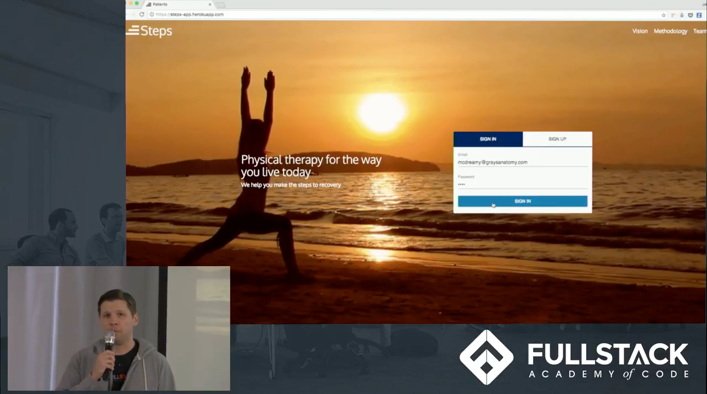

# Steps 

_Physical therapy for the way you live today_

Steps is a web application built to enhance the physical therapy experience from all angles. For patients, it provides an informative and engaging portal to help you better understand how to perform your exercises and your recovery progress. On the therapist side, the platform eases the process of creating patients' plans and managing their recovery process.

Check out our [walkthrough of the app](https://www.youtube.com/watch?v=m3esDy0-FOo) for an overview of the end-to-end experience.

[](https://www.youtube.com/watch?v=m3esDy0-FOo)

We also encourage you to expore our [live demo](https://steps-app.herokuapp.com/) with the following users:  

**Therapist**  
Username: mcdreamy@steps.com  
Password: 1234  

**Patient**  
Username: amanda@gmail.com  
Password: 1234 

[](https://steps-app.herokuapp.com/)

## Table of Contents
- [Steps](#steps)
  * [Table of Contents](#table-of-contents)
  * [Running Locally](#running-locally)
    + [Prerequisites](#prerequisites)
    + [Installing dependencies](#installing-dependencies)
    + [Running the app](#running-the-app)
      - [Dev Server](#dev-server)
      - [Webpack HMR Server](#webpack-hmr-server)
  * [Running in Prod](#running-in-prod)
  * [Environment variables](#environment-variables)
    + [Sending Emails](#sending-emails)
    + [Production Variables](#production-variables)
  * [Testing](#testing)
  * [Credit](#credit)

## Running Locally

### Prerequisites
- [Node.js (>6.7) and npm](https://nodejs.org/en/)
- [PostgreSQL](https://www.postgresql.org/)
- [SendGrid account](https://app.sendgrid.com/)

### Installing dependencies

```sh
npm install
```

This will install all runtime dependencies, as well as Webpack build and Mocha/Chai/Enzyme testing tools.

Also, make sure to populate the proper [environment variables](#environment-variables) for your local setup.

### Running the app

There are two ways to run the app in development mode:

#### Dev Server

```sh
npm run build-watch
npm run dev
```

The first command will run Webpack in watch mode, rebuilding the client static files in '/public' every time a change is made to the source files. The second command will run the Node.js server in development mode. This setup simulates a production environment without the performance enhacements.

#### Webpack HMR Server

```sh
npm run hmr
npm start
```

The command starts a little Node.js server that serves only the webpack bundle. This setup gives us two main advantages:

- Changes to React components cause automatic page refreshes
- Updates to static files like CSS are injected into the running app without requiring a full refresh

API requests from this app will proxy to port `8080`, so you will still need the Node server running.

## Running in Prod

Running the application in Prod is similar to running it locally:

```sh
npm install
npm run build
npm start
```

The build should be run at some point before the app is uploaded to the production server, otherwise the build files must be uploaded as well. Also, consider the [production environment variables](#production-variables) required here.

## Environment variables

We are using the `dotenv` package and `.env` file to emulate environment variables in development mode. You should create a `.env` file at the root of this project and it should have the following:

```
SESSION_SECRET=YOUR_SECRET
```

### Sending Emails

If you would like the application to send emails on your behalf, you will need to add your API key and sender email account as follows:

```
SENDGRID_API_KEY=YOUR_API_KEY
EMAIL=YOUR_SENDER_EMAIL_ACCOUNT
```

### Production Variables

1. `DATABASE_URL` environment variable must point to your PostgreSQL DB
1. `NODE_ENV` environment variable must equal `production`
1. `PORT` environment variable must be set to the listening port of the Node app

## Testing

To run the test suite, execute the command `npm test`

The easiest way to test is with [Postman](https://www.getpostman.com/). You can use our development testing
collection to help you get started!

[](https://app.getpostman.com/run-collection/b679dd0210a9500f7fef)

## Credit

We relied heavily on others' artwork and iconography to make this app look great. To give credit where credit is due, here are the artists:

- Emojis made by [EmojiOne](http://emojione.com/)
- Material Icons made by [Google](https://material.io/icons/)
- Home Icon made by [Aneeque Ahmed](https://thenounproject.com/aneeque) from [Noun Project](https://thenounproject.com/term/home-sweet-home/720520/)
- User Icon made by [Jamison Wieser](https://thenounproject.com/jamison) from [Noun Project](https://thenounproject.com/term/user-account/642902/)
- Messages Icon made by [i cons](https://thenounproject.com/ahmad102) from [Noun Project](https://thenounproject.com/term/messages/680439/)
- Patients Icon made by [Gan Khoon Lay](https://thenounproject.com/leremy) from [Noun Project](https://thenounproject.com/term/man-stretching-on-floor/637472/)
- Exercises Icon made by [Hea Poh Lin](https://thenounproject.com/charlenehea) from [Noun Project](https://thenounproject.com/term/dumbbell/589747/)
- Dashboard Icon made by [Viktor Vorobyev](https://thenounproject.com/vityavorobyev) from [Noun Project](https://thenounproject.com/term/car-dashboard/572825/)
- Plan Icon made by [unlimicon](https://thenounproject.com/unlimicon) from [Noun Project](https://thenounproject.com/term/list/638134/)
- 404 Turtle made by [Freepik](http://www.flaticon.com/authors/freepik) from [flaticon](http://www.flaticon.com/free-icon/turtle_170464)
